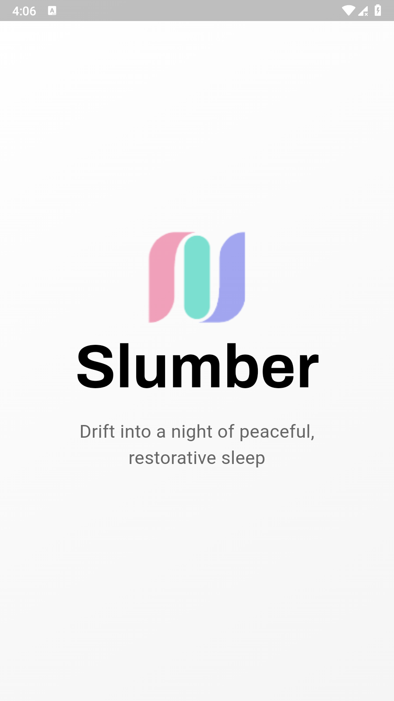
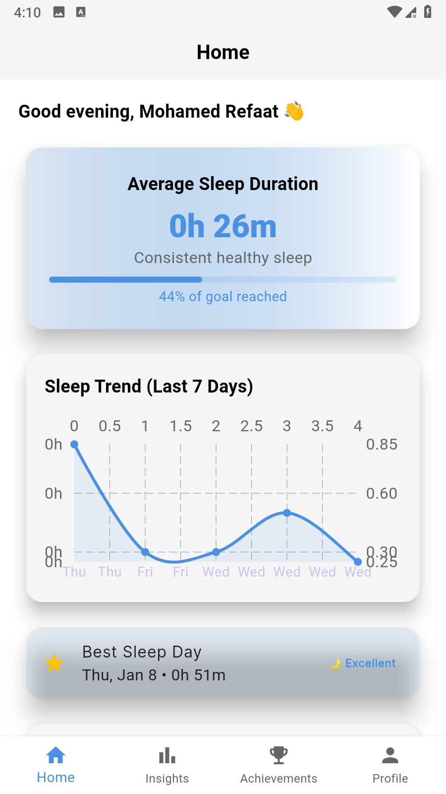
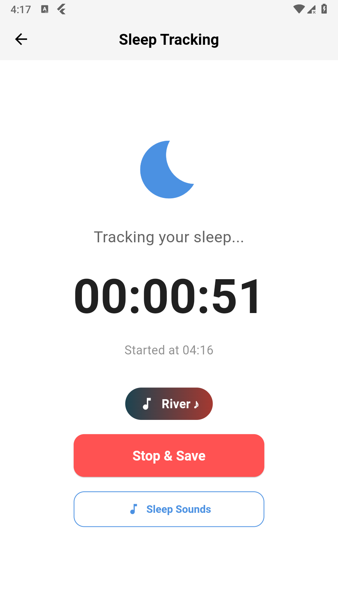
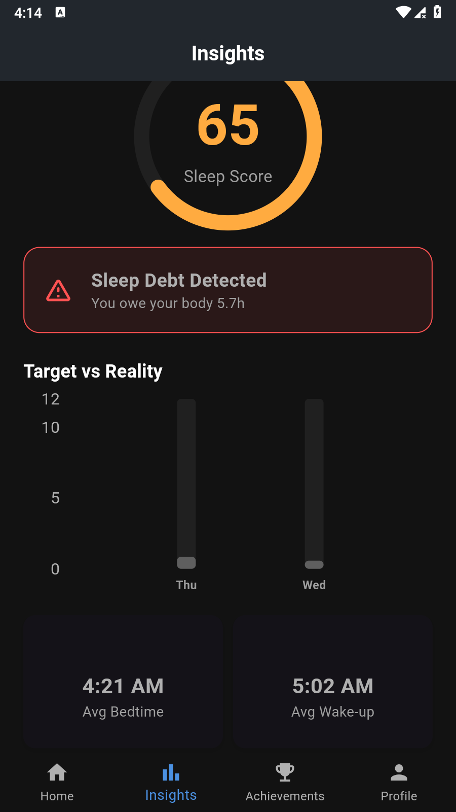
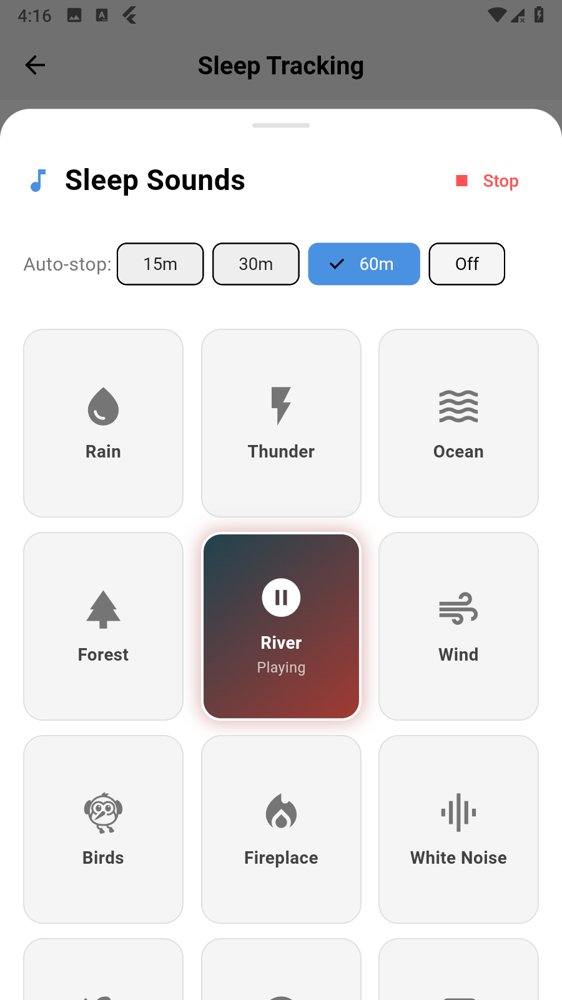
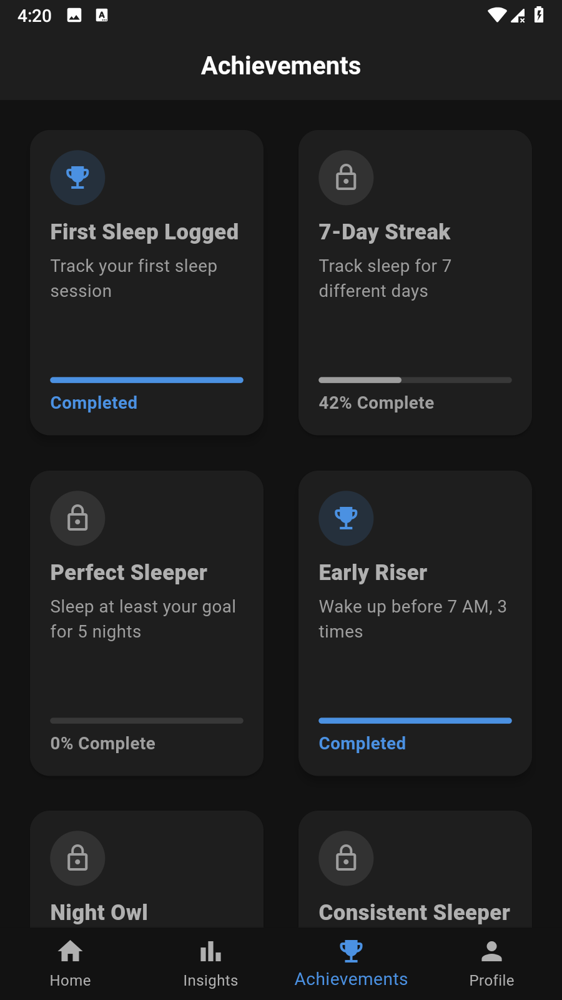
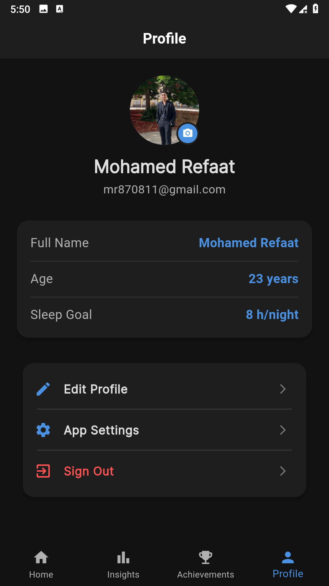
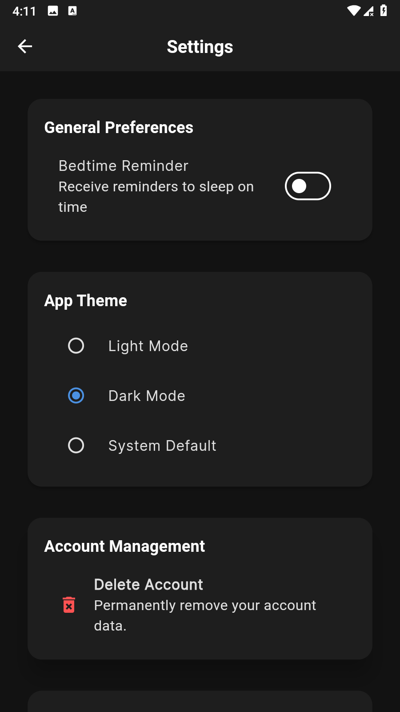

# 🌙 Slumber – Smart Sleep Tracker

A professional Flutter mobile application designed to help users improve their sleep quality through intelligent tracking, personalized insights, ambient sleep sounds, and smart reminders.

Built with **Clean Architecture**, **Firebase**, and **Bloc (Cubit)** state management.

---

## 📸 Screenshots

<p align="center">
  
  
  
  
</p>
<p align="center">
  
  
  
  
</p>

---

## ✨ Features

### 🛏️ Sleep Tracking
- Start/Stop sleep tracking with a live timer
- **Persistent tracking** – survives app termination using local storage
- Ongoing notification while tracking is active
- Active session banner on dashboard with live elapsed time
- Automatic session recovery on app relaunch

### 📊 Smart Analytics & Insights
- **Sleep Score Algorithm** based on duration + consistency + bedtime
- Weekly sleep trends with interactive charts (FL Charts)
- Average sleep duration with goal comparison
- Sleep debt detection and tracking
- Best sleep day identification
- Average bedtime & wake-up time statistics

### 🎵 Sleep Sounds (Relax Module)
- 12 ambient sounds (Rain, Ocean, Forest, Fireplace, White Noise, etc.)
- Auto-loop playback
- Sleep timer (15/30/60 min auto-stop)
- Integrated within Sleep Tracking screen via Bottom Sheet
- Sound automatically stops when sleep tracking ends

### 🔔 Smart Notifications
- **Bedtime reminders** using Android AlarmManager (works even when app is killed)
- Persistent sleep tracking notification
- Notification tap navigates to active tracking session
- Reminders automatically reschedule daily

### 🏆 Achievements System
- 6 achievement types (First Sleep, 7-Day Streak, Perfect Sleeper, etc.)
- Real-time progress tracking
- Animated unlock dialog
- Reactive calculation based on sleep history

### 👤 Profile & Settings
- Edit profile (Name, Age, Sleep Goal)
- Theme switching (Light / Dark / System) with persistence
- Bedtime reminder configuration
- Account management (Sign Out / Delete Account)
- App info (Version, Privacy Policy, Contact)

### 🔐 Authentication
- Email & Password (Sign Up / Sign In)
- Google Sign-In
- Firebase Authentication
- Auto-login on app restart

---

## 🏗️ Architecture

```
Clean Architecture + Feature-Based Structure
```

```
lib/
├── core/
│   ├── notifications/        # AlarmManager + Local Notifications
│   ├── services/             # Sleep Session persistence
│   ├── theme/                # Theme Cubit + Service
│   ├── user/                 # User Cubit (Global)
│   ├── utils/                # Router, Theme, Colors, Assets
│   ├── widgets/              # Shared widgets
│   └── firestore_service.dart
│
├── features/
│   ├── auth/                 # Sign In / Sign Up / Auth Service
│   ├── home/                 # Dashboard + widgets
│   ├── sleep_tracking/       # Tracking View + Sound Sheet
│   ├── sleep/                # Insights + History + Score Calculator
│   ├── relax/                # Sound Cubit + Models
│   ├── achievements/         # Rules + Cubit + UI
│   ├── profile/              # Profile + Edit + Settings
│   ├── onbording/            # Onboarding screens
│   └── splash/               # Splash screen
│
├── screens.dart              # Main navigation shell
└── main.dart                 # App entry point
```

---

## 🛠️ Tech Stack

| Technology | Usage |
|-----------|-------|
| **Flutter** | Cross-platform UI framework |
| **Firebase Auth** | Authentication (Email + Google) |
| **Cloud Firestore** | Real-time database |
| **Bloc / Cubit** | State management |
| **GoRouter** | Declarative navigation |
| **FL Charts** | Data visualization |
| **AudioPlayers** | Ambient sound playback |
| **Android AlarmManager** | Scheduled notifications (survives app kill) |
| **Flutter Local Notifications** | Push notifications |
| **SharedPreferences** | Local persistence |
| **ScreenUtil** | Responsive design |
| **Google Fonts** | Typography |
| **Package Info Plus** | App version info |

---

## 🚀 Getting Started

### Prerequisites
- Flutter SDK (3.7.2+)
- Firebase project configured
- Android Studio / VS Code

### Installation

```bash
# Clone the repository
git clone https://github.com/YOUR_USERNAME/slumber.git

# Navigate to project
cd slumber

# Install dependencies
flutter pub get

# Run the app
flutter run
```

### Firebase Setup
1. Create a Firebase project at [console.firebase.google.com](https://console.firebase.google.com)
2. Enable **Authentication** (Email/Password + Google)
3. Enable **Cloud Firestore**
4. Download `google-services.json` (Android) and `GoogleService-Info.plist` (iOS)
5. Place them in the appropriate directories

---

## 📱 Firestore Structure

```
users/{uid}
├── id
├── name
├── email
├── age
├── sleepGoalHours
└── bedtime

users/{uid}/sleepHistory/{docId}
├── startTime
├── endTime
└── duration
```

---

## 🎯 Key Technical Highlights

- **Persistent Sleep Tracking**: Sessions survive app termination using SharedPreferences
- **AlarmManager Integration**: Bedtime reminders fire even when the app is completely killed
- **Reactive Achievements**: Auto-calculated based on real-time sleep data streams
- **Sleep Score Algorithm**: Multi-factor scoring (duration + consistency + bedtime timing)
- **Audio Loop Management**: Seamless ambient sound playback with auto-stop timer
- **Live UI Updates**: Active session banner updates every second across screens
- **Theme Persistence**: User theme preference saved and restored on app launch

---

## 🧪 Comprehensive Unit Testing
To ensure the highest level of reliability and accuracy, the core business logic is heavily tested:
- **Algorithms Tested:** `SleepScoreCalculator`, `AchievementsRules`, and `SleepSessionService`.
- **Test Coverage:** Validates edge cases like day-overlapping sleep sessions, accurate sleep debt calculations, and precise achievement progress tracking.
- **Status:** 42/42 Tests Passing ✅.

---

## 📄 License

This project is for portfolio/educational purposes.

---

<p align="center">
  Built with ❤️ using Flutter
</p>